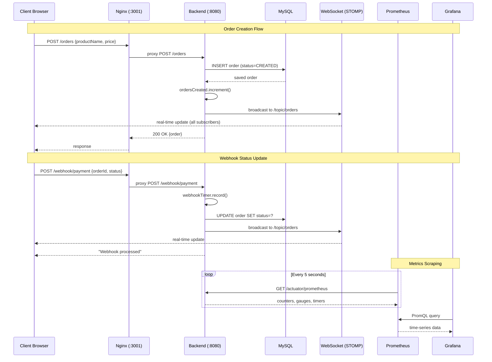
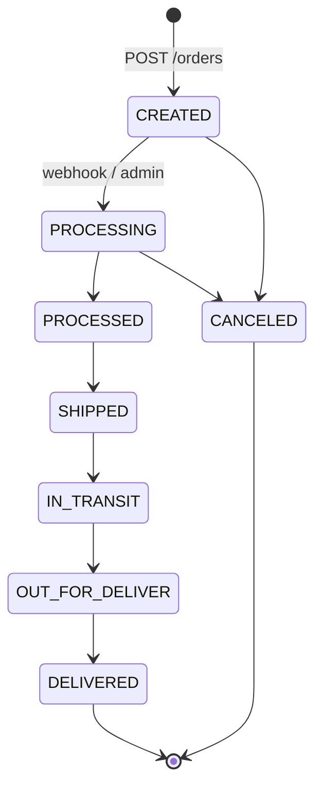
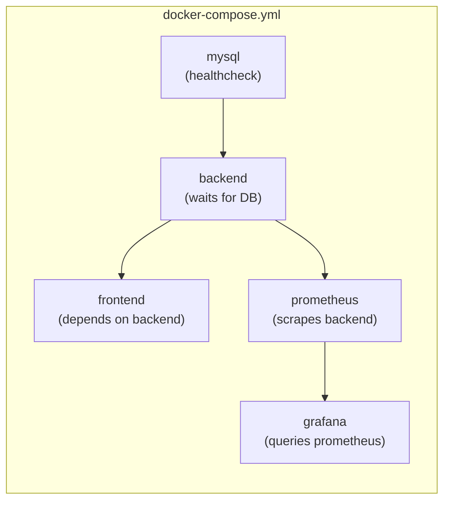

# 🚀 Real-Time Order Management System

A full-stack, real-time order management system with WebSocket-powered live updates, webhook processing, and a complete monitoring stack — all containerized with Docker Compose.

---

## System Architecture

```mermaid
graph TB
    subgraph "Docker Compose Stack"
        direction TB
        
        subgraph "Data Layer"
            DB["🗄️ MySQL 8.0\n:3307 → :3306\norderdb"]
        end
        
        subgraph "Application Layer"
            BE["⚙️ Spring Boot 4\n:8080\nREST + WebSocket + Actuator"]
        end
        
        subgraph "Presentation Layer"
            FE["🖥️ React 19 + Nginx\n:3001 → :80\nAdmin + Client Portal"]
        end
        
        subgraph "Monitoring Layer"
            PROM["📈 Prometheus\n:9090\nMetrics scraping"]
            GRAF["📊 Grafana\n:3000\n11-panel dashboard"]
        end
    end

    FE -- "REST API\n/orders, /webhook" --> BE
    FE -- "STOMP over WebSocket\n/ws → /topic/orders" --> BE
    BE -- "JPA / Hibernate" --> DB
    PROM -- "scrape /actuator/prometheus\nevery 5s" --> BE
    GRAF -- "PromQL queries" --> PROM

    CLIENT["👤 Client Browser"] --> FE
    ADMIN["🛠️ Admin Browser"] --> FE
    EXT["🪝 External Webhook"] --> BE

    style DB fill:#1e3a5f,stroke:#38bdf8
    style BE fill:#3b1f5b,stroke:#a855f7
    style FE fill:#1a3b2f,stroke:#22c55e
    style PROM fill:#5a3100,stroke:#f59e0b
    style GRAF fill:#5a3100,stroke:#f59e0b
```



## Quick Start

```bash
# Clone the repository
git clone <repo-url>
cd "Real Time OMS"

# Start everything (builds + runs all 5 services)
docker compose up --build -d

# Watch logs
docker compose logs -f
```

### Access Points

| Service | URL | Credentials |
|---------|-----|-------------|
| **Frontend** | http://localhost:3001 | — |
| **Backend API** | http://localhost:8080/orders | — |
| **Grafana** | http://localhost:3000 | `admin` / `admin` |
| **Prometheus** | http://localhost:9090 | — |
| **MySQL** | `localhost:3307` | `root` / `root` |

## Project Structure

```
Real Time OMS/
├── docker-compose.yml              # 🐳 5-service orchestration
│
├── oms/oms/                        # ⚙️ Spring Boot Backend
│   ├── Dockerfile                  #    Multi-stage Maven → JRE
│   ├── pom.xml                     #    Maven dependencies
│   ├── README.md                   #    📖 Backend documentation
│   └── src/main/
│       ├── java/com/datahook/oms/
│       │   ├── OmsApplication.java
│       │   ├── configuration/      #    WebSocket + Metrics config
│       │   ├── constants/          #    OrderStatus enum
│       │   ├── controller/         #    REST + Webhook + Metrics
│       │   ├── models/             #    Order JPA entity
│       │   ├── repository/         #    JPA repository
│       │   └── services/           #    Business logic + WS broadcast
│       └── resources/
│           ├── application.properties
│           └── application-docker.properties
│
├── order-ui/                       # 🖥️ React Frontend
│   ├── Dockerfile                  #    Multi-stage Node → Nginx
│   ├── nginx.conf                  #    Proxy config
│   ├── .env.docker                 #    Docker env vars
│   ├── README.md                   #    📖 Frontend documentation
│   └── src/
│       ├── pages/                  #    LandingPage, AdminPage, ClientPage
│       ├── components/             #    Dashboard, OrderTable, NodeGraph, Toast...
│       └── services/               #    api.js (Axios), websocket.js (STOMP)
│
└── monitoring/                     # 📊 Monitoring Stack
    ├── README.md                   #    📖 Monitoring documentation
    ├── prometheus/
    │   └── prometheus.yml          #    Scrape config (5s interval)
    └── grafana/
        ├── provisioning/           #    Auto-provisioned datasource + dashboard
        └── dashboards/
            └── oms-dashboard.json  #    Pre-built 11-panel dashboard
```

## Real-Time Data Flow



## Order Lifecycle



## Tech Stack

| Layer | Technology | Purpose |
|-------|-----------|---------|
| **Backend** | Spring Boot 4.0 | REST API, WebSocket, JPA |
| **Frontend** | React 19 | SPA with real-time UI |
| **Styling** | TailwindCSS 4 | Utility-first CSS |
| **Database** | MySQL 8.0 | Persistent order storage |
| **WebSocket** | STOMP + SockJS | Real-time bidirectional messaging |
| **Reverse Proxy** | Nginx | SPA serving + API/WS proxying |
| **Metrics** | Micrometer + Actuator | Application instrumentation |
| **Monitoring** | Prometheus | Time-series metrics scraping |
| **Dashboards** | Grafana | Visualization + alerting |
| **Containers** | Docker Compose | Multi-service orchestration |

## Features

### Admin Dashboard
- 📊 **Real-time stats** — order counts, revenue, status breakdown
- 🌐 **Live node graph** — SVG visualization of connected clients, webhooks, Prometheus
- 📋 **Order table** — search, sort, paginate, with animated row highlights on updates
- 🪝 **Webhook simulator** — fire webhooks from the UI with payload preview
- 📜 **Event log** — live stream of WebSocket and webhook events
- 🔔 **Toast notifications** — auto-dismiss alerts on every status change

### Client Portal
- 📦 **Place orders** — product name + price
- 🔍 **Track orders** — live progress stepper with 7-step flow
- 🔔 **Real-time notifications** — toast alerts on status changes

### Monitoring (Grafana)
- ⚡ WebSocket active connections gauge
- 📨 Messages sent/received stats
- 📦 Order creation rate (bar chart)
- 📊 Orders by status (donut chart)
- 🪝 Webhook throughput + latency
- 💾 JVM heap memory
- 🖥️ CPU usage

## API Reference

| Method | Endpoint | Description |
|--------|----------|-------------|
| `GET` | `/orders` | List all orders |
| `POST` | `/orders` | Create order `{productName, price}` |
| `PUT` | `/orders/{id}/status?status=X` | Update order status |
| `POST` | `/webhook/payment` | Webhook `{orderId, status}` |
| `GET` | `/api/metrics/summary` | Metrics JSON for frontend |
| `GET` | `/actuator/prometheus` | Prometheus-format metrics |
| `GET` | `/actuator/health` | Health check |
| — | `/ws` (STOMP) | WebSocket endpoint |
| — | `/topic/orders` (STOMP) | Subscribe for order updates |

## Docker Services



| Service | Image | Port | Depends On |
|---------|-------|------|------------|
| `mysql` | `mysql:8.0` | `3307:3306` | — |
| `backend` | Built from `oms/oms/Dockerfile` | `8080:8080` | `mysql` (healthy) |
| `frontend` | Built from `order-ui/Dockerfile` | `3001:80` | `backend` |
| `prometheus` | `prom/prometheus:latest` | `9090:9090` | `backend` |
| `grafana` | `grafana/grafana:latest` | `3000:3000` | `prometheus` |

## Useful Commands

```bash
# Start all services
docker compose up --build -d

# Stop all services
docker compose down

# Stop + delete all data (clean slate)
docker compose down -v

# Rebuild a single service
docker compose up --build backend -d

# View logs for a specific service
docker compose logs -f backend

# Check running containers
docker compose ps
```

## Running Without Docker

```bash
# 1. Start MySQL on localhost:3306
#    CREATE DATABASE orderdb;

# 2. Start Backend
cd oms/oms
./mvnw spring-boot:run
# → http://localhost:8080

# 3. Start Frontend
cd order-ui
npm install && npm start
# → http://localhost:3000
```

## Folder-Level Documentation

Each major folder has its own detailed README:

| Folder | README | What It Covers |
|--------|--------|----------------|
| [`oms/oms/`](oms/oms/) | [📖 README](oms/oms/README.md) | Backend architecture, API endpoints, order lifecycle, tech stack |
| [`order-ui/`](order-ui/) | [📖 README](order-ui/README.md) | Component architecture, pages, services, env vars, nginx proxy |
| [`monitoring/`](monitoring/) | [📖 README](monitoring/README.md) | Prometheus config, Grafana provisioning, dashboard panels, metric names |

---

<p align="center">
  Built with ❤️ using Spring Boot • React • Docker • Prometheus • Grafana
</p>
