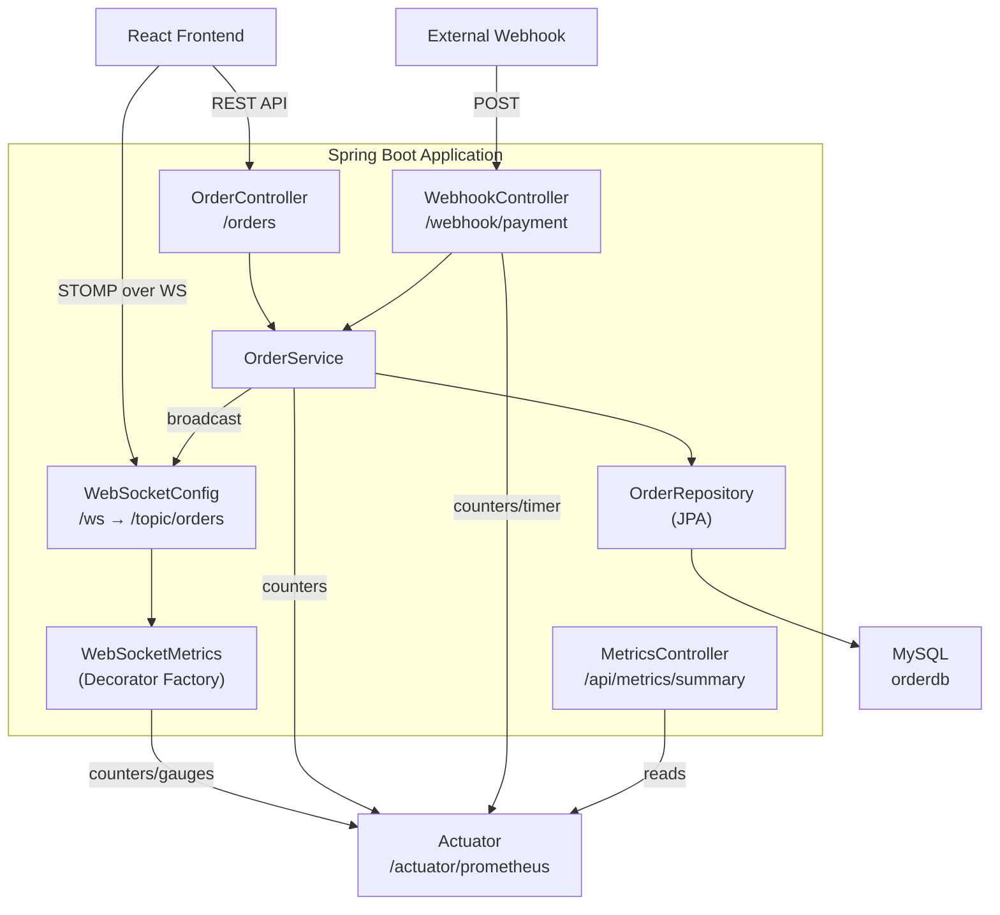
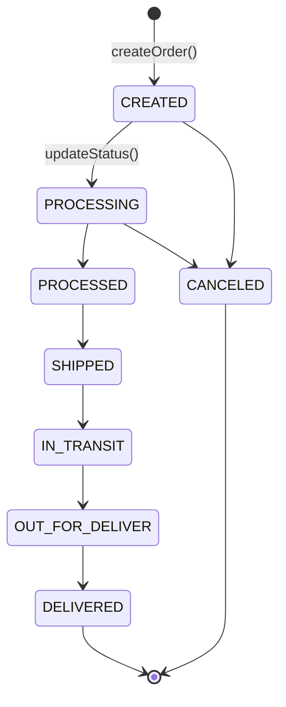

# ⚙️ OMS Backend — Spring Boot

The backend service for the Real-Time Order Management System. Built with **Spring Boot 4**, it provides REST APIs, real-time WebSocket messaging, webhook processing, and Prometheus-compatible metrics via Actuator.

## Architecture



## Folder Structure

```
oms/oms/
├── Dockerfile                  # Multi-stage: Maven build → JRE runtime
├── .dockerignore               # Excludes target/, .idea/, etc.
├── pom.xml                     # Maven dependencies
└── src/main/
    ├── java/com/datahook/oms/
    │   ├── OmsApplication.java         # Spring Boot entry point
    │   ├── configuration/
    │   │   ├── WebSocketConfig.java     # STOMP broker + WS endpoint
    │   │   └── WebSocketMetrics.java    # WS connection/message instrumentation
    │   ├── constants/
    │   │   └── OrderStatus.java         # Enum: order lifecycle states
    │   ├── controller/
    │   │   ├── OrderController.java     # CRUD REST endpoints
    │   │   ├── WebhookController.java   # POST /webhook/payment
    │   │   └── MetricsController.java   # GET /api/metrics/summary
    │   ├── models/
    │   │   └── Order.java               # JPA entity (id, productName, price, status, createdTime)
    │   ├── repository/
    │   │   └── OrderRepository.java     # JpaRepository<Order, String>
    │   └── services/
    │       └── OrderService.java        # Business logic + WS broadcast
    └── resources/
        ├── application.properties       # Default config (localhost DB)
        └── application-docker.properties # Docker config (mysql:3306)
```

## Order Lifecycle



## API Endpoints

### REST

| Method | Endpoint | Description |
|--------|----------|-------------|
| `GET` | `/orders` | List all orders |
| `POST` | `/orders` | Create a new order |
| `PUT` | `/orders/{id}/status?status=X` | Update order status |
| `POST` | `/webhook/payment` | Process payment webhook |
| `GET` | `/api/metrics/summary` | Live metrics summary (JSON) |

### WebSocket (STOMP)

| Endpoint | Description |
|----------|-------------|
| `/ws` | SockJS/STOMP WebSocket connection endpoint |
| `/topic/orders` | Subscribe — receives order create/update events |

### Actuator

| Endpoint | Description |
|----------|-------------|
| `/actuator/health` | Application health check |
| `/actuator/prometheus` | Prometheus-formatted metrics |
| `/actuator/metrics` | Micrometer metrics index |

## Request / Response Examples

### Create Order
```bash
curl -X POST http://localhost:8080/orders \
  -H "Content-Type: application/json" \
  -d '{"productName": "Wireless Headphones", "price": 49.99}'
```
```json
{
  "id": "ORD1A2B3C4D",
  "productName": "Wireless Headphones",
  "price": 49.99,
  "status": "CREATED",
  "createdTime": "2026-02-19T00:00:00.000+00:00"
}
```

### Webhook (Payment)
```bash
curl -X POST http://localhost:8080/webhook/payment \
  -H "Content-Type: application/json" \
  -d '{"orderId": "ORD1A2B3C4D", "status": "PROCESSING"}'
```

## Tech Stack

| Dependency | Purpose |
|------------|---------|
| `spring-boot-starter-web` | REST API |
| `spring-boot-starter-websocket` | STOMP/SockJS real-time messaging |
| `spring-boot-starter-data-jpa` | ORM / database access |
| `spring-boot-starter-actuator` | Health + metrics endpoints |
| `micrometer-registry-prometheus` | Prometheus metrics export |
| `mysql-connector-j` | MySQL JDBC driver |
| `lombok` | Boilerplate reduction |

## Running Locally (without Docker)

```bash
# Prerequisites: Java 21+, Maven 3.9+, MySQL 8 running on localhost:3306

# 1. Create database
mysql -uroot -p -e "CREATE DATABASE IF NOT EXISTS orderdb;"

# 2. Run
./mvnw spring-boot:run

# Server starts on http://localhost:8080
```

## Docker Build

```bash
# Standalone build
docker build -t oms-backend .

# Run
docker run -p 8080:8080 \
  -e SPRING_PROFILES_ACTIVE=docker \
  --network oms-network \
  oms-backend
```

The Dockerfile uses a **multi-stage build**:
1. **Build stage** — `maven:3.9-eclipse-temurin-21` copies source, resolves dependencies offline, builds the JAR
2. **Run stage** — `eclipse-temurin:21-jre-alpine` runs the slim JAR (~180MB vs ~600MB)
