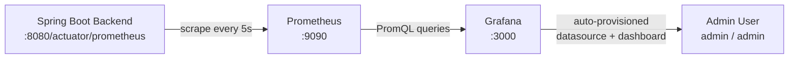
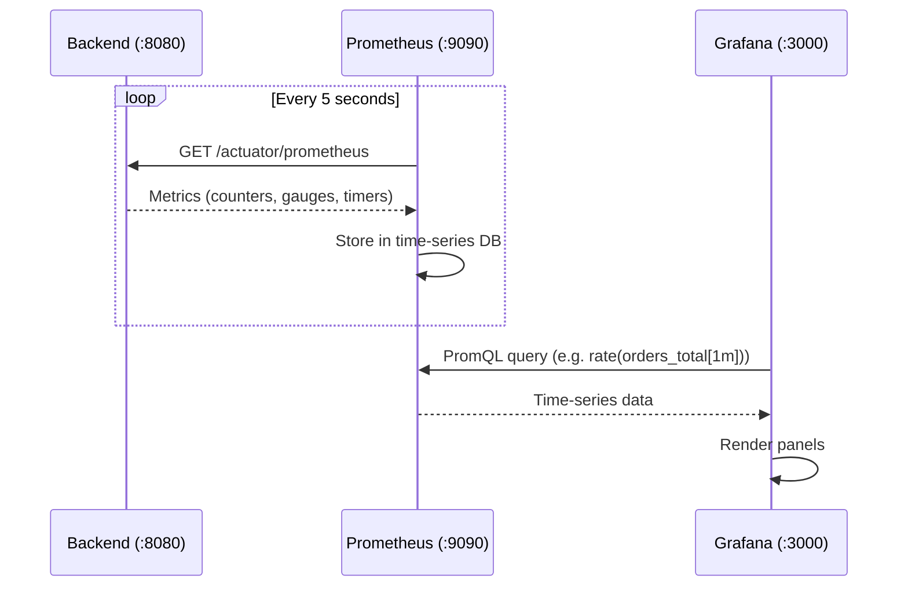

# 📊 Monitoring Stack

This folder contains the complete monitoring infrastructure for the OMS, powered by **Prometheus** and **Grafana**. It is automatically provisioned when you run `docker compose up`.

## Architecture



## Folder Structure

```
monitoring/
├── prometheus/
│   └── prometheus.yml          # Scrape configuration
└── grafana/
    ├── provisioning/
    │   ├── datasources/
    │   │   └── datasource.yml  # Auto-register Prometheus as data source
    │   └── dashboards/
    │       └── dashboard.yml   # Tell Grafana where to find dashboard JSON
    └── dashboards/
        └── oms-dashboard.json  # Pre-built 11-panel dashboard
```

## Files Explained

### `prometheus/prometheus.yml`

Configures Prometheus to scrape the Spring Boot backend's Actuator endpoint every **5 seconds**:

| Setting | Value |
|---------|-------|
| Scrape interval | `5s` |
| Target | `backend:8080` (Docker internal hostname) |
| Metrics path | `/actuator/prometheus` |

### `grafana/provisioning/datasources/datasource.yml`

Auto-provisions a Prometheus data source in Grafana on first boot:

| Setting | Value |
|---------|-------|
| Name | `Prometheus` |
| Type | `prometheus` |
| URL | `http://prometheus:9090` |
| Default | `true` |

### `grafana/provisioning/dashboards/dashboard.yml`

Tells Grafana to load dashboard JSON files from `/var/lib/grafana/dashboards` (volume-mounted from this folder).

### `grafana/dashboards/oms-dashboard.json`

Pre-built dashboard with **11 panels**:

| Panel | Type | Metric |
|-------|------|--------|
| ⚡ WebSocket Active Connections | Gauge | `ws_connections_active` |
| 🔌 Total WS Connections | Stat | `ws_connections_established_total` |
| 📨 WS Messages Sent | Stat | `ws_messages_sent_total` |
| 📦 Orders Created | Stat | `orders_total` |
| 🪝 Webhook Calls | Stat | `webhook_calls_total` |
| 🪝 Webhook Calls Over Time | Time Series | `rate(webhook_calls_total[1m])` |
| 📦 Order Creation Rate | Bar Chart | `rate(orders_total[1m])` |
| 📊 Orders by Status | Donut | `orders_status_updates_total` |
| ⏱️ Webhook Avg Latency | Time Series | `webhook_duration_seconds_max` |
| 💾 JVM Heap Memory | Time Series | `jvm_memory_used_bytes` |
| 🖥️ System CPU Usage | Time Series | `process_cpu_usage` |

## How It Works



## Accessing

| Service | URL | Credentials |
|---------|-----|-------------|
| Prometheus | http://localhost:9090 | — |
| Grafana | http://localhost:3000 | `admin` / `admin` |

## Custom Metrics Exposed by Backend

| Micrometer Name | Prometheus Name | Type | Description |
|-----------------|-----------------|------|-------------|
| `ws.connections.active` | `ws_connections_active` | Gauge | Currently open WebSocket connections |
| `ws.connections.established` | `ws_connections_established_total` | Counter | Total WS connections ever established |
| `ws.messages.sent` | `ws_messages_sent_total` | Counter | Total messages broadcast via WS |
| `ws.messages.received` | `ws_messages_received_total` | Counter | Total messages received via WS |
| `orders.created` | `orders_total` | Counter | Total orders created |
| `orders.status.updates` | `orders_status_updates_total` | Counter | Status transitions, tagged by `status` |
| `webhook.calls` | `webhook_calls_total` | Counter | Successful webhook invocations |
| `webhook.errors` | `webhook_errors_total` | Counter | Failed webhook invocations |
| `webhook.duration` | `webhook_duration_seconds_*` | Timer | Webhook processing latency |
