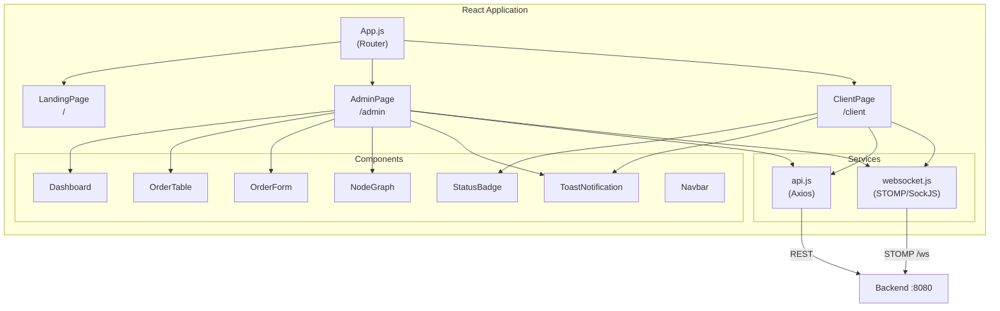
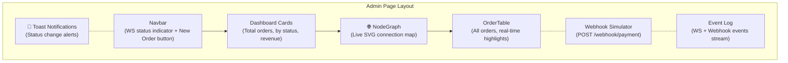

# 🖥️ OMS Frontend — React

The client-facing web application for the Real-Time Order Management System. Built with **React 19** and **TailwindCSS**, it provides an Admin Dashboard, Client Portal, and real-time updates over WebSocket.

## Architecture



## Folder Structure

```
order-ui/
├── Dockerfile             # Multi-stage: Node build → nginx serve
├── .dockerignore           # Excludes node_modules, build/
├── .env.docker            # Docker env vars (empty API base, /ws)
├── nginx.conf             # Nginx: serve SPA + proxy to backend
├── package.json
├── tailwind.config.js
└── src/
    ├── App.js             # React Router setup
    ├── index.js            # Entry point
    ├── index.css           # TailwindCSS imports + custom animations
    ├── pages/
    │   ├── LandingPage.js  # Role selection (Admin vs Client)
    │   ├── AdminPage.js    # Full dashboard with WS, webhooks, node graph
    │   └── ClientPage.js   # Place + track orders in real-time
    ├── components/
    │   ├── Dashboard.js        # Stats cards (total, by status, revenue)
    │   ├── OrderTable.js       # Sortable/filterable order grid
    │   ├── OrderForm.js        # Create order modal
    │   ├── StatusBadge.js      # Color-coded status pill
    │   ├── NodeGraph.js        # Live SVG connection map
    │   ├── ToastNotification.js # Auto-dismiss toast system
    │   └── Navbar.js           # Top navigation bar
    └── services/
        ├── api.js          # Axios client: fetchOrders, createOrder, simulateWebhook, fetchMetricsSummary
        └── websocket.js    # STOMP client: connect, subscribe /topic/orders, disconnect
```

## Pages

### 🏠 Landing Page (`/`)

Role selection screen with two portals:
- **Admin Dashboard** → `/admin`
- **Client Portal** → `/client`

### 🛠️ Admin Dashboard (`/admin`)



**Features:**
- 📊 Real-time stats cards with order counts and revenue
- 🌐 Live SVG node graph showing connected clients, webhooks, and Prometheus
- 📋 Searchable, sortable order table with row highlight on update
- 🪝 Webhook simulator with payload preview
- 📜 Event log streaming WS and webhook events
- 🔔 Toast notifications on every status change

### 👤 Client Portal (`/client`)

**Features:**
- 📦 Place new orders with product name and price
- 🔍 Track orders by ID with live progress stepper
- 📋 Recent orders list (clickable to track)
- 🔔 Toast notifications on status changes

## Key Components

| Component | Description |
|-----------|-------------|
| `Dashboard.js` | 4 stat cards: total orders, per-status breakdown, total revenue, recent activity |
| `OrderTable.js` | Paginated table with search, sort, and animated row highlights on WS updates |
| `OrderForm.js` | Modal form for creating orders (product name + price) |
| `StatusBadge.js` | Color-coded pill for each of the 9 order statuses |
| `NodeGraph.js` | SVG diagram: backend hub + client nodes orbiting + webhook/Prometheus links. Auto-refreshes from `/api/metrics/summary` |
| `ToastNotification.js` | Slide-in toasts with 4 types (success/warning/error/info), auto-dismiss after 4s |
| `Navbar.js` | Sticky top bar with WebSocket connection indicator |

## Services

### `api.js` (Axios HTTP Client)

| Function | Method | Endpoint | Description |
|----------|--------|----------|-------------|
| `fetchOrders()` | GET | `/orders` | List all orders |
| `createOrder(data)` | POST | `/orders` | Create new order |
| `updateOrderStatus(id, status)` | PUT | `/orders/{id}/status` | Update status |
| `simulateWebhook(orderId, status)` | POST | `/webhook/payment` | Fire webhook |
| `fetchMetricsSummary()` | GET | `/api/metrics/summary` | Live metrics JSON |

### `websocket.js` (STOMP over SockJS)

| Function | Description |
|----------|-------------|
| `connectWebSocket(onMessage, onConnect, onDisconnect)` | Connects to `/ws`, subscribes to `/topic/orders` |
| `disconnectWebSocket()` | Cleanly disconnects the STOMP client |

## Environment Variables

| Variable | Default (local) | Docker (`.env.docker`) | Description |
|----------|-----------------|------------------------|-------------|
| `REACT_APP_API_BASE` | `http://localhost:8080` | *(empty)* | API base URL; empty = relative (nginx proxies) |
| `REACT_APP_WS_URL` | `http://localhost:8080/ws` | `/ws` | WebSocket URL; `/ws` = relative (nginx proxies) |

## Running Locally

```bash
# Prerequisites: Node 18+, backend running on :8080

npm install
npm start

# Opens http://localhost:3000
```

## Docker Build

```bash
docker build -t oms-frontend .
docker run -p 3001:80 oms-frontend
```

**Multi-stage Dockerfile:**
1. **Build stage** — `node:18-alpine` installs deps, copies `.env.docker` → `.env`, builds optimized production bundle
2. **Serve stage** — `nginx:alpine` copies `build/` and `nginx.conf`, serves on port 80

## Nginx Proxy Configuration

In Docker, the nginx server handles:

| Path | Proxied To |
|------|-----------|
| `/orders/**` | `backend:8080` |
| `/webhook/**` | `backend:8080` |
| `/api/**` | `backend:8080` |
| `/ws/**` | `backend:8080` (WebSocket upgrade) |
| `/actuator/**` | `backend:8080` |
| Everything else | Serve React SPA (`index.html`) |
